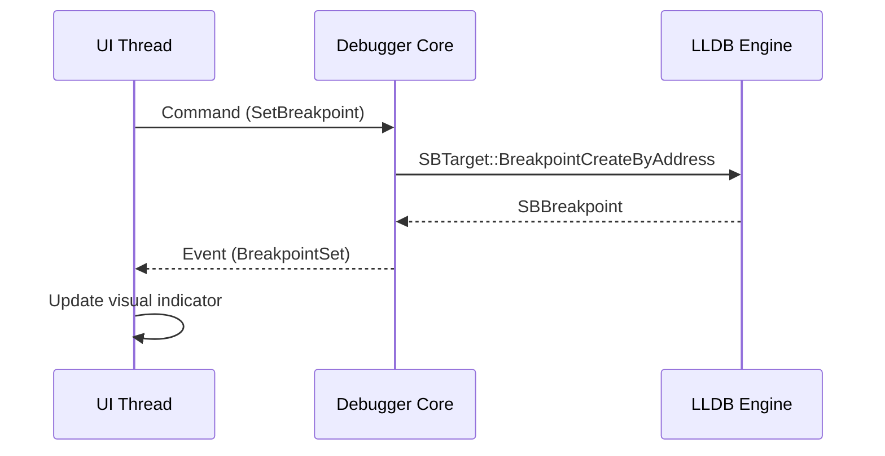
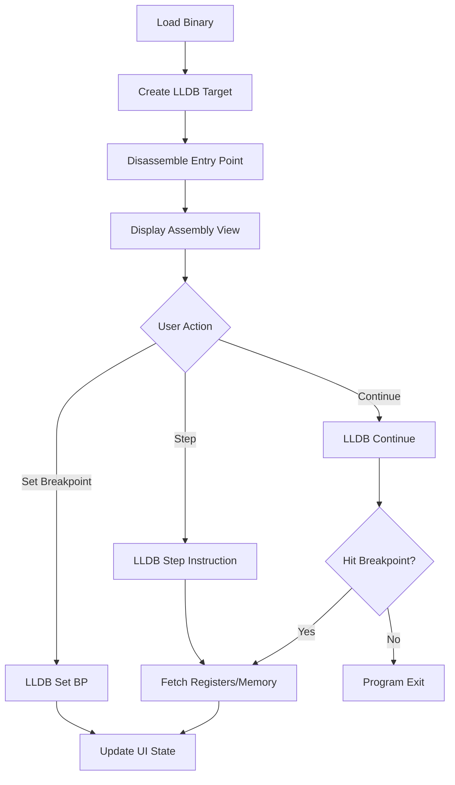

## Context

Building an LLDB-based visual debugger for iOS binaries in Rust. Target users are reverse engineers analyzing unpacked/decrypted iOS executables. Current state: greenfield project with no existing codebase.

**Constraints:**
- Must use LLDB as the sole debugging engine
- Rust as implementation language
- Desktop application (not web-based)
- Focus on assembly-level debugging (not source-level)

## Goals / Non-Goals

**Goals:**
- Create a functional debugger with x64dbg-style UX for iOS binary analysis
- Establish clean separation between debugging core and UI presentation
- Support MVP features: binary loading, assembly display, breakpoints, step execution
- Provide real-time state inspection (registers, memory)

**Non-Goals:**
- Source-level debugging (C/Objective-C/Swift)
- Remote debugging over network
- Multi-process debugging
- Scripting/automation capabilities (defer to post-MVP)

## Decisions

### Decision 1: Architecture - Two-Layer Design

**Choice:** Separate debugger core (LLDB wrapper) from UI layer with event-driven communication.

```
┌─────────────────────────────────────┐
│         UI Layer (egui)             │
│  ┌─────────┐ ┌─────────┐ ┌────────┐│
│  │Assembly │ │Registers│ │ Memory ││
│  │  View   │ │  Panel  │ │ Viewer ││
│  └─────────┘ └─────────┘ └────────┘│
└──────────────┬──────────────────────┘
               │ Events (channel)
               ↓
┌──────────────────────────────────────┐
│       Debugger Core                  │
│  ┌──────────────────────────────┐   │
│  │   LLDB Integration Layer     │   │
│  │  (lldb-sys bindings)         │   │
│  └──────────────────────────────┘   │
└──────────────────────────────────────┘
```

**Rationale:** Decouples UI framework from debugging logic, enables testing core independently, allows future UI replacements.

**Alternatives considered:**
- Monolithic design: Rejected due to tight coupling and testing difficulty
- Plugin architecture: Overkill for MVP scope

### Decision 2: UI Framework - egui

**Choice:** Use egui for immediate-mode GUI rendering.

**Rationale:**
- Pure Rust, no C++ dependencies
- Lightweight and fast for technical UIs
- Good for dense information display (assembly, hex dumps)
- Cross-platform (macOS, Linux, Windows)

**Alternatives considered:**
- iced: More complex, retained-mode paradigm less suited for rapidly updating debug views
- tauri: Web-based, adds unnecessary complexity and memory overhead
- gtk-rs: Heavy C dependencies, harder to distribute

### Decision 3: LLDB Bindings - lldb-sys

**Choice:** Use lldb-sys crate for LLDB C API bindings.

**Rationale:**
- Direct FFI to LLDB C API
- Low-level control over debugging operations
- Mature and maintained

**Alternatives considered:**
- SBDebugger Python bridge: Adds Python runtime dependency
- Custom FFI bindings: Reinventing the wheel

### Decision 4: Disassembly Strategy - LLDB Built-in

**Choice:** Use LLDB's built-in disassembler rather than external library.

**Rationale:**
- Already available through LLDB API
- Consistent with debugging context
- One less dependency

**Alternatives considered:**
- capstone-rs: Additional dependency, potential version conflicts with LLDB's internal capstone

### Decision 5: Event Communication - mpsc Channels

**Choice:** Use Rust std::sync::mpsc channels for core-to-UI communication.



**Rationale:**
- Simple, built-in, no external dependencies
- Clear ownership boundaries
- Sufficient for single-process debugger

**Alternatives considered:**
- tokio async channels: Overkill for this use case
- crossbeam channels: Unnecessary complexity

## Data Flow



## Risks / Trade-offs

**[Risk] LLDB API instability across versions**
→ Mitigation: Pin to specific LLDB version, document compatibility matrix

**[Risk] UI responsiveness during long operations**
→ Mitigation: Run LLDB operations on separate thread, use async events

**[Risk] Memory consumption with large binaries**
→ Mitigation: Lazy-load disassembly, paginate assembly view

**[Trade-off] egui immediate-mode overhead**
→ Accept: Redrawing entire UI each frame is acceptable for debug tool with <60fps requirement

## Migration Plan

N/A - New project, no migration needed.

## Open Questions

- **Q:** Support for ARM64 and x86_64, or ARM64 only initially?
  - **Leaning:** ARM64 only for MVP (iOS focus), add x86_64 in P1

- **Q:** Persist breakpoints between sessions?
  - **Leaning:** No for MVP, add in P2 as "workspace" feature
