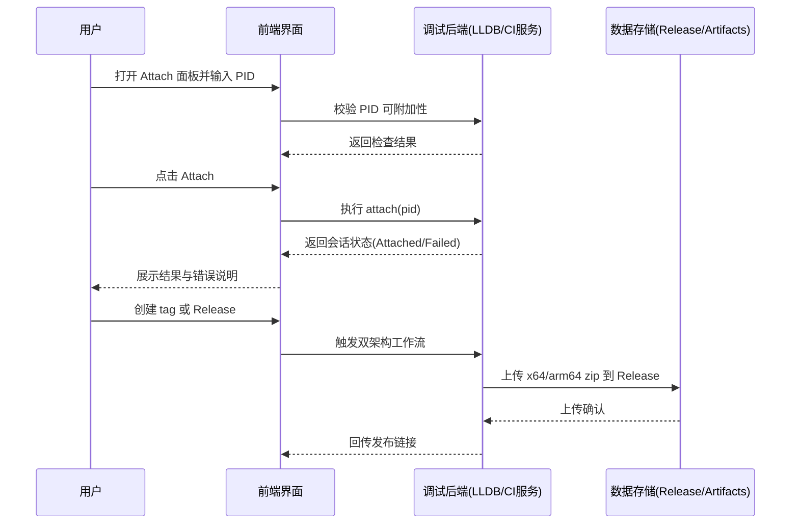
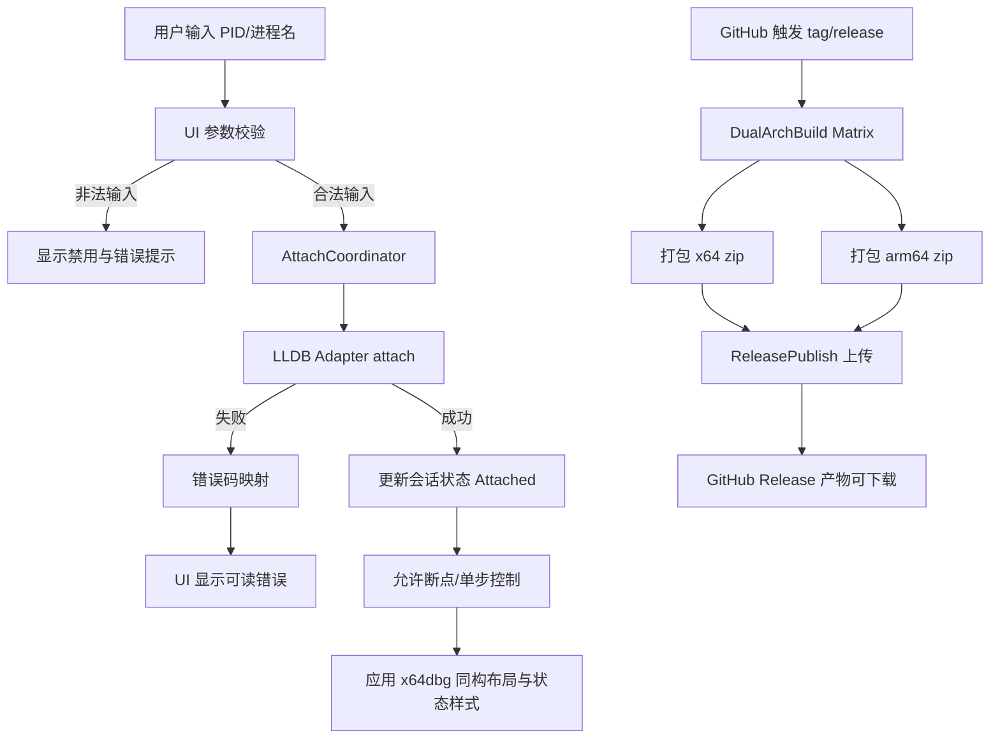
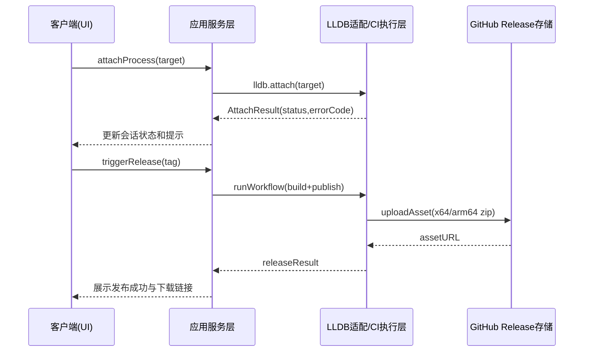

## Context

当前项目已具备基于 LLDB 的基础调试能力与 macOS 客户端打包流程，但存在两类关键缺口：

1. 调试链路缺口：缺乏对“已运行进程”的附加调试入口，导致只能从启动时接管进程，无法覆盖在线问题排查场景。
2. 交付链路缺口：虽有基础构建工作流，但未形成稳定的双架构（`x86_64-apple-darwin`/`aarch64-apple-darwin`）统一产物与自动发布闭环。

约束条件：
- 附加能力依赖 LLDB 与 macOS 权限模型（如 `task_for_pid`）；
- CI 环境为 GitHub Actions；
- 发布目标按“git publish/release”解释为 GitHub Release Assets 自动上传；
- UI 体验目标为与 x64dbg 高度一致（布局、交互、状态反馈）；
- UI 实现允许“先接入可复用 UI 组件验证，再重写自有实现”的过渡策略；
- 文档与工件输出使用中文。

### 高层级 UI 原型（沿用 proposal 并细化状态）

```text
+--------------------------------------------------------------------------------------+
| Rust LLDB Visual Debugger                                      Session: Detached      |
+--------------------------------------------------------------------------------------+
| [Load Binary] [Attach Process] [Continue] [Step Over] [Step In] [Stop]              |
+--------------------------------------------------------------------------------------+
| Attach Drawer                                                                        |
|  Mode: (o) PID   ( ) Process Name                                                    |
|  PID : [ 12345               ]   Name: [ SpringBoard           ]                     |
|  Privilege Check: [OK] [Need Elevated Rights] [Denied]                              |
|  [Attach]  [Refresh]                                                                  |
|  Hint: Attach disabled when no valid target / privilege check pending                |
+--------------------------------------------------------------------------------------+
| Runtime Status                                                                       |
|  Normal   : "Ready to attach"                                                        |
|  Hover    : Attach button highlighted                                                |
|  Error    : "Attach failed: process not found / permission denied / timeout"        |
|  Disabled : Invalid PID or unresolved permission state                               |
+--------------------------------------------------------------------------------------+
```

### 用户交互流程（Mermaid）



## Goals / Non-Goals

**Goals:**
- 在 LLDB 支持条件下实现附加进程调试，支持 PID/进程名两类目标选择。
- 将附加失败原因结构化输出（权限不足、目标不存在、超时、LLDB 错误）。
- 实现与 x64dbg 一致的核心界面信息架构、操作路径和视觉分区。
- 在不阻塞交付的前提下建立 UI 过渡方案：先验证，再重写为自有实现。
- 构建 GitHub Actions 双架构产物并统一命名，确保可追溯与可下载。
- 发布流程自动上传产物到 GitHub Release，减少手工操作。

**Non-Goals:**
- 不实现 Windows/Linux 构建与发布。
- 不在本次变更中引入远程调试协议（如 gdb-remote）。
- 不覆盖 notarization、公证签名等 Apple 分发合规流程。
- 不长期绑定第三方 x64dbg UI 组件作为最终交付依赖。

## Decisions

1. 决策：附加入口放在现有控制面板，新增 Attach Drawer
   - 原因：避免引入新窗口状态同步复杂度，复用现有执行控制上下文。
   - 备选：
     - 独立弹窗：交互清晰但状态同步复杂，放弃。
     - 命令行触发：实现快但可用性差，放弃。

2. 决策：调试核心新增 `AttachRequest`/`AttachResult` 统一模型
   - 原因：让 UI、LLDB 适配层和错误提示共享同一语义，便于测试。
   - 备选：
     - 直接在 UI 调用低层 API：耦合高，难测试，放弃。

3. 决策：CI 采用 matrix 并行两目标构建
   - 原因：配置简洁、日志独立、失败定位清晰。
   - 备选：
     - 单 Job 串行构建：耗时更长，产物管理复杂，放弃。
     - Universal2 单产物：用户要求双独立版本，放弃。

4. 决策：发布以 GitHub Release Assets 为唯一上传目标
   - 原因：与 GitHub 原生流程兼容，便于权限与审计。
   - 备选：
     - 上传 Actions Artifact：不等价于正式发布，放弃。
     - 第三方制品库：引入额外凭据与成本，放弃。

5. 决策：UI 采用“两阶段同构实现”方案
   - 方案：
     - Phase A：快速同构，优先复用可接入的 x64dbg UI 相关组件/样式资源验证布局与交互。
     - Phase B：最终重写，将同构界面迁移到项目自有 UI 代码并移除过渡依赖。
   - 原因：兼顾交付速度与长期可维护性，避免早期在视觉细节上反复返工。
   - 备选：
     - 一次性完全重写：风险低但交付慢，放弃。
     - 永久依赖外部 UI 组件：维护与许可风险高，放弃。

### 组件架构图（ASCII）

```text
系统组件层次
├── UI Layer (egui)
│   ├── X64dbgParityShell
│   │   ├── DockLayoutManager
│   │   └── StyleTokenMapper
│   ├── ControlPanel
│   │   ├── AttachDrawer
│   │   └── ExecutionButtons
│   ├── AssemblyView
│   └── StatusBar
├── Application Layer
│   ├── DebugSessionService
│   │   ├── AttachCoordinator
│   │   └── ErrorTranslator
│   └── BuildReleaseDescriptor
├── Infrastructure Layer
│   ├── LLDB Adapter
│   │   ├── ProcessLocator
│   │   └── AttachExecutor
│   └── GitHub Actions Workflow
│       ├── DualArchBuild Job
│       └── ReleasePublish Job
└── Storage/Delivery
    └── GitHub Release Assets
```

### 数据流图（Mermaid）



### API 调用时序图（Mermaid）



### 详细代码变更清单

| 文件路径 | 变更类型 | 变更说明 | 影响模块 |
|---|---|---|---|
| `src/core/lldb/client.rs` | 修改 | 增加 `attach_process`、错误码映射与状态返回 | 调试核心 |
| `src/core/lldb/session.rs` | 修改 | 增加附加态生命周期（detached/attaching/attached/failed） | 调试核心 |
| `src/core/types.rs` | 修改 | 新增 `AttachRequest`/`AttachResult` 数据结构 | 公共类型 |
| `src/ui/layout/mod.rs` | 修改/新增 | 实现 x64dbg 同构停靠布局与窗口分区 | UI |
| `src/ui/style/mod.rs` | 修改/新增 | 统一 x64dbg 风格 token 与状态样式映射 | UI |
| `src/ui/control_panel.rs` | 修改 | 新增 Attach Drawer、输入校验、状态渲染 | UI |
| `src/ui/status_bar.rs` | 修改 | 展示附加状态与错误信息 | UI |
| `.github/workflows/build-macos-client.yml` | 修改 | matrix 双架构构建 + release 上传 job | CI/CD |
| `scripts/build_macos_client.sh` | 修改 | 支持 CI 命名参数与架构化 zip 输出 | 构建脚本 |
| `README.md` | 修改 | 新增附加调试与发布流程说明（中文） | 文档 |

## Risks / Trade-offs

- [附加权限受限] → 通过启动前检查与明确错误提示降低排障成本；文档标注 macOS 权限前提。
- [双架构构建耗时增加] → 使用 `actions/cache` 缓存 Cargo 依赖，构建 job 并行执行。
- [Release 上传权限不足] → workflow 明确 `permissions: contents: write`，并在失败日志中提示 token 权限。
- [LLDB attach 行为在不同 macOS 版本差异] → 在集成测试中覆盖至少 1 个 Intel 与 1 个 Apple Silicon runner。
- [x64dbg 同构在跨平台控件能力上不完全对齐] → 先定义视觉与交互基线清单，允许内部实现差异但保证用户可感知一致。
- [过渡依赖带来许可与维护成本] → 在 Phase B 设置“移除外部依赖”完成门槛并纳入验收。

## Migration Plan

1. Phase A：完成附加调试代码与 x64dbg 同构 UI 原型接入，保留现有“加载二进制启动”路径作为回退。
2. 更新工作流为 matrix 双架构构建，并在草稿 release 上验证产物命名与上传。
3. Phase B：将同构 UI 重写为项目自有实现，移除过渡依赖并保持交互一致。
4. 合并后以预发布 tag（如 `v0.1.0-rc1`）运行端到端验证。
5. 若发布流程异常，回滚策略为：
   - 暂时禁用 publish job（仅保留 build job）；
   - 继续手工上传产物，待修复后恢复自动上传。

## Open Questions

- 是否需要在 attach 模式下限制某些执行控制按钮（如未附加成功时禁用 step/continue）？
- Release 资产命名是否需要包含 commit short SHA 以支持同版本重发追踪？
- 是否在后续迭代引入 Universal2 作为第三种可选产物？
- x64dbg 同构验收应以“像素级一致”还是“交互与信息架构一致”为标准？
