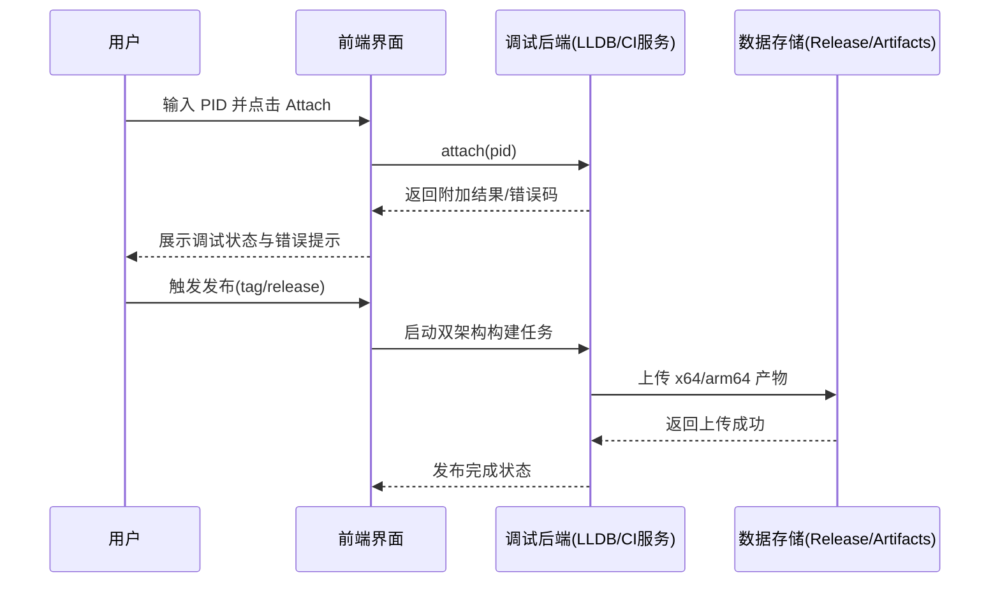

## Why

当前调试器缺少“附加到正在运行进程”的标准能力，导致线上或长流程问题难以复现场景化排查；同时 macOS 发布仍依赖手工构建与上传，无法稳定产出 x64/arm64 双架构交付物。另一个关键缺口是 UI 风格与目标用户熟悉的 x64dbg 操作心智不一致，增加了学习成本；因此本次需要同时补齐调试能力、交付自动化和 x64dbg 同构界面策略。

## What Changes

- 新增“附加进程调试”能力：在 LLDB 可用前提下，支持按 PID/进程名附加并进入可控调试状态。
- 新增附加调试前置检查：目标可见性、权限提示、附加失败原因分类与可读错误反馈。
- 新增 x64dbg 同构 UI 目标：核心布局、面板结构、交互流与状态反馈尽量做到“与 x64dbg 一致”。
- 新增 UI 两阶段落地策略：如可行，先通过 x64dbg UI 库/组件进行快速验证，随后重写为项目自有 UI 实现，保持外观与交互一致性。
- 新增 GitHub Actions 双架构构建流程：默认生成 `x86_64-apple-darwin` 与 `aarch64-apple-darwin` 两套产物。
- 新增发布自动化：在发布触发时自动上传两套构建产物到 GitHub Release（作为 release assets）。
- 补充中文文档与操作说明：明确触发方式、产物命名规则、失败回滚与验收口径。

### 高层级 UI 原型（附加进程调试）

```text
+------------------------------------------------------------------------------------+
| Rust LLDB Visual Debugger                                          [Attach] [x]    |
+------------------------------------------------------------------------------------+
| Target Binary: /path/to/app                                                      |
| Attach Mode: (o) PID  ( ) Process Name                                           |
| PID Input   : [ 12345               ]   Process Name: [ Safari             ]      |
| Permission  : [Ready] [Need sudo] [Denied]                                       |
| Action      : [Attach Now] [Refresh Process List]                                 |
+------------------------------------------------------------------------------------+
| Status Panel                                                                       |
| - Normal : Waiting for user action                                                 |
| - Hover  : Attach button highlighted                                               |
| - Error  : "Permission denied (task_for_pid), check entitlement/sudo"            |
| - Disabled: Attach button disabled when no valid PID/name                          |
+------------------------------------------------------------------------------------+
```

### 用户交互流程（Mermaid）



### 代码变更表

| 文件路径 | 变更类型 | 变更原因 | 影响范围 |
|---|---|---|---|
| `src/core/lldb/client.rs` | 修改 | 增加 attach 入口与错误映射 | 调试核心 |
| `src/core/lldb/session.rs` | 修改 | 增加附加前检查与会话状态流转 | 调试核心 |
| `src/ui/layout/*.rs` | 修改/新增 | 对齐 x64dbg 的窗口分区与停靠布局 | UI 框架 |
| `src/ui/widgets/*.rs` | 修改/新增 | 对齐 x64dbg 风格控件与交互状态 | UI 交互 |
| `src/ui/control_panel.rs` | 修改 | 增加 PID/进程名附加控件与状态展示 | UI 交互 |
| `.github/workflows/build-macos-client.yml` | 修改 | 双架构构建与发布上传 | CI/CD |
| `scripts/build_macos_client.sh` | 修改 | 标准化产物命名并支持 CI 参数 | 构建脚本 |
| `README.md` | 修改 | 中文使用说明、触发/产物/发布说明 | 文档 |

## Capabilities

### New Capabilities

- `process-attach-debugging`: 支持附加到目标运行进程并进入可控调试会话，含失败回退与错误可视化。
- `macos-dual-arch-build`: GitHub Actions 自动构建 macOS x64 与 arm64 两类客户端产物。
- `github-release-publish`: 构建完成后自动上传产物到 GitHub Release，并附带统一命名约定。

### Modified Capabilities

- `lldb-integration`: 扩展现有 LLDB 集成需求，纳入 attach 能力、附加前置检查与错误分类。
- `ui-framework`: 扩展 UI 框架需求，要求界面布局与交互行为对齐 x64dbg，并支持“过渡依赖 + 最终自研重写”路径。

## Impact

- 代码：调试核心（LLDB 会话与命令层）、UI 控制面板、构建脚本、GitHub 工作流。
- API/系统：新增对 GitHub Actions/Release 上传流程的要求；LLDB 能力由“启动调试”扩展为“附加调试”。
- 依赖：运行附加调试需宿主机具备 LLDB 与对应权限（如 `task_for_pid` 许可链）；CI 需配置发布权限（`contents: write`）；UI 过渡期可能引入 x64dbg 相关组件依赖。
- 风险：附加权限受 macOS 安全策略影响；跨架构构建时间增加，需要缓存与失败重试策略；x64dbg 风格同构在跨平台和许可边界上存在实现约束。
