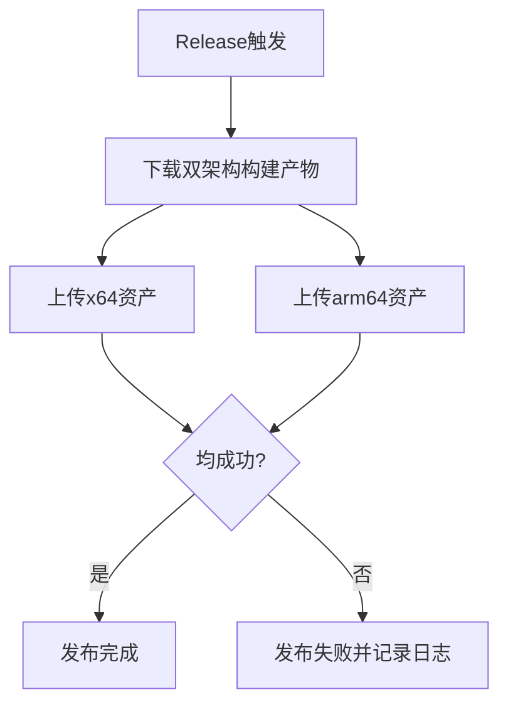

## ADDED Requirements

### Requirement: Auto-upload dual-arch assets to GitHub Release
The release pipeline SHALL upload both macOS architecture packages to the target GitHub Release automatically.

#### Scenario: Publish on release trigger
- **WHEN** a release event or tagged release workflow is triggered
- **THEN** the system uploads both x64 and arm64 zip artifacts as release assets

### Requirement: Prevent partial publish success without visibility
The release pipeline SHALL fail the publish stage if either architecture asset upload fails, and SHALL emit actionable logs.

#### Scenario: One asset upload fails
- **WHEN** x64 or arm64 upload returns non-success status
- **THEN** publish stage is marked failed and error output identifies failed asset and reason

### Requirement: Require release write permission declaration
The workflow SHALL explicitly declare the permission required for release publishing.

#### Scenario: Permission declaration check
- **WHEN** workflow configuration is evaluated
- **THEN** `permissions.contents` is set to `write` for publish job

### 能力模型（Mermaid）

### 功能需求表

| 需求 | 类型 | 描述 | 验收场景 |
|---|---|---|---|
| Auto-upload dual-arch assets to GitHub Release | ADDED | 自动上传两类架构产物 | Publish on release trigger |
| Prevent partial publish success without visibility | ADDED | 任一上传失败即失败并可定位 | One asset upload fails |
| Require release write permission declaration | ADDED | 发布任务声明最小必要权限 | Permission declaration check |
