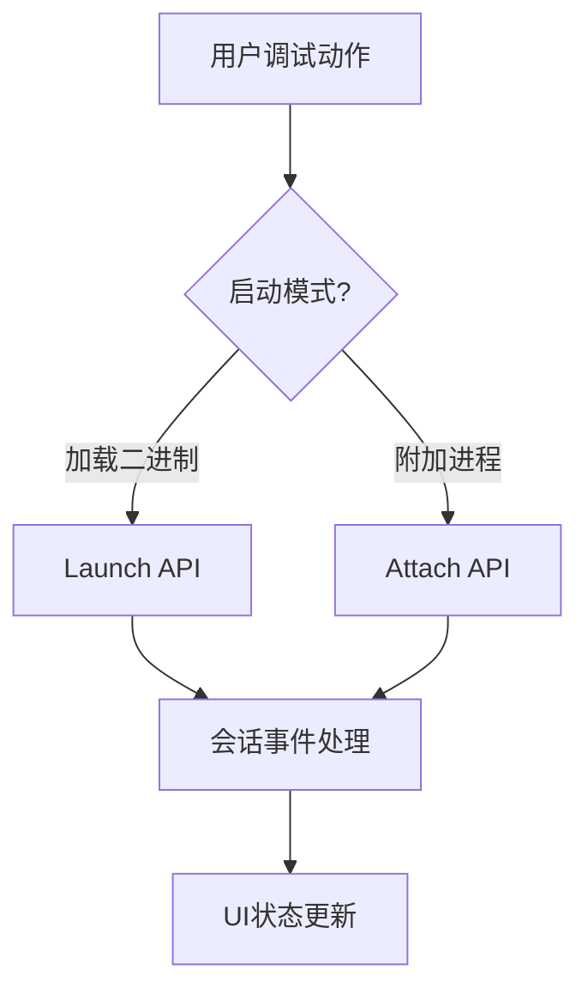

## MODIFIED Requirements

### Requirement: Initialize LLDB session
The system SHALL initialize an LLDB debugging session for the target binary, and SHALL support creating the session by launching a binary or attaching to a running process.

#### Scenario: Create debug session from binary
- **WHEN** binary is loaded
- **THEN** system creates an LLDB target and process

#### Scenario: Create debug session from attach target
- **WHEN** user submits a valid PID or process name for attach
- **THEN** system creates an LLDB target handle and binds it to the running process

### Requirement: Execute LLDB commands
The system SHALL translate user actions into LLDB API calls, including launch-mode and attach-mode operations.

#### Scenario: Set breakpoint via LLDB
- **WHEN** user sets a breakpoint
- **THEN** system calls LLDB breakpoint API with the target address

#### Scenario: Execute attach command via LLDB
- **WHEN** user confirms attach action
- **THEN** system invokes LLDB attach API and returns structured attach result

### Requirement: Handle LLDB events
The system SHALL process LLDB events and update UI state accordingly, including attach success, attach failure, and post-attach pause state.

#### Scenario: Process breakpoint event
- **WHEN** LLDB reports a breakpoint hit
- **THEN** system updates UI to show paused state at breakpoint location

#### Scenario: Process attach failure event
- **WHEN** LLDB attach operation fails
- **THEN** system emits categorized error and keeps previous session state unchanged

### 能力模型（Mermaid）

### 功能需求表

| 需求 | 类型 | 描述 | 验收场景 |
|---|---|---|---|
| Initialize LLDB session | MODIFIED | 支持 launch + attach 双会话入口 | Create debug session from binary / Create debug session from attach target |
| Execute LLDB commands | MODIFIED | 在现有命令映射中纳入 attach API | Set breakpoint via LLDB / Execute attach command via LLDB |
| Handle LLDB events | MODIFIED | 增加附加相关事件处理 | Process breakpoint event / Process attach failure event |
