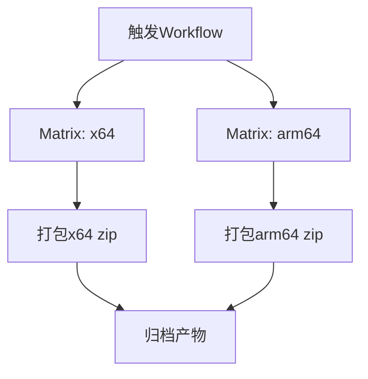

## ADDED Requirements

### Requirement: Build macOS x64 and arm64 artifacts in one workflow run
The CI system SHALL build macOS client artifacts for `x86_64-apple-darwin` and `aarch64-apple-darwin` in a single workflow execution.

#### Scenario: Matrix build succeeds for both targets
- **WHEN** the workflow is triggered by push, pull_request, or manual dispatch
- **THEN** the pipeline produces two successful build jobs, one per target architecture

### Requirement: Use deterministic artifact naming
The CI system SHALL name generated packages using a deterministic scheme containing application name, version, and target triple.

#### Scenario: Package naming validation
- **WHEN** arch-specific build packaging finishes
- **THEN** produced filenames match `rust-lldb-visual-debugger-<version>-<target>.zip`

### Requirement: Preserve build traceability metadata
The CI system SHALL expose commit and run metadata in build outputs for auditability.

#### Scenario: Metadata in workflow summary
- **WHEN** workflow run completes
- **THEN** summary includes source commit, run ID, and links to both architecture artifacts

### 能力模型（Mermaid）

### 功能需求表

| 需求 | 类型 | 描述 | 验收场景 |
|---|---|---|---|
| Build macOS x64 and arm64 artifacts in one workflow run | ADDED | 单次流程产出双架构构建结果 | Matrix build succeeds for both targets |
| Use deterministic artifact naming | ADDED | 统一命名规则便于发布和回溯 | Package naming validation |
| Preserve build traceability metadata | ADDED | 提供构建追溯信息 | Metadata in workflow summary |
