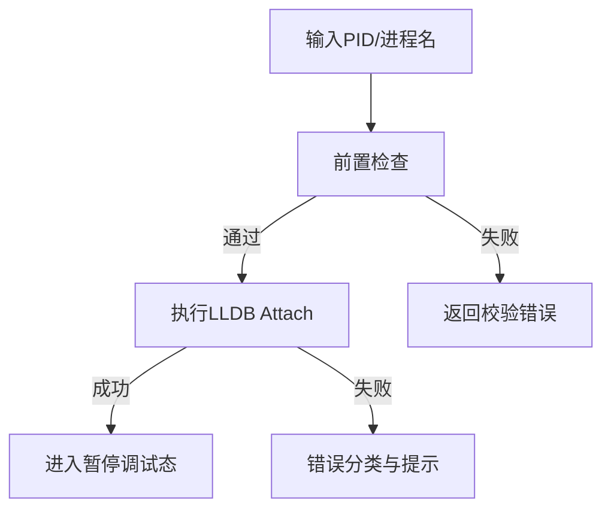

## ADDED Requirements

### Requirement: Attach to running process by PID or name
The system SHALL allow the operator to attach an LLDB debugging session to a running process by PID or process name.

#### Scenario: Attach with PID
- **WHEN** the user provides a valid PID and clicks attach
- **THEN** the system attaches to the target process and enters paused debugging state

#### Scenario: Attach with process name
- **WHEN** the user provides an exact process name and the process is uniquely resolved
- **THEN** the system attaches to that process and surfaces the active thread context

### Requirement: Validate attach preconditions before execution
The system SHALL validate process visibility, target existence, and attach permission before invoking the LLDB attach operation.

#### Scenario: Reject invalid target
- **WHEN** the user submits an empty PID/name or a non-existent target
- **THEN** the system blocks attach execution and displays a validation error

#### Scenario: Reject insufficient permission
- **WHEN** the environment does not satisfy required attach permissions
- **THEN** the system returns a permission-specific error without creating a partial session

### Requirement: Provide deterministic attach error classification
The system SHALL classify attach failures into stable categories for user guidance and observability.

#### Scenario: Map attach failure to category
- **WHEN** LLDB returns an attach failure
- **THEN** the system maps it to one of `permission_denied`, `target_not_found`, `timeout`, or `lldb_error`

### 能力模型（Mermaid）

### 功能需求表

| 需求 | 类型 | 描述 | 验收场景 |
|---|---|---|---|
| Attach to running process by PID or name | ADDED | 支持按 PID 或进程名附加 | Attach with PID / Attach with process name |
| Validate attach preconditions before execution | ADDED | 附加前执行目标与权限检查 | Reject invalid target / Reject insufficient permission |
| Provide deterministic attach error classification | ADDED | 将失败映射为稳定错误类别 | Map attach failure to category |
