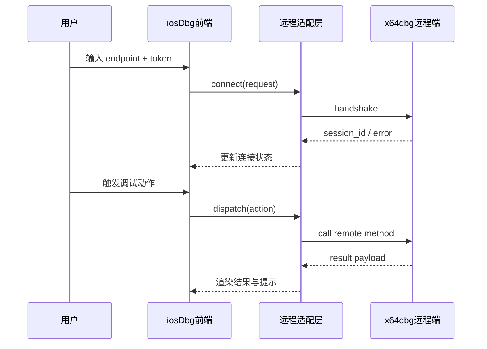
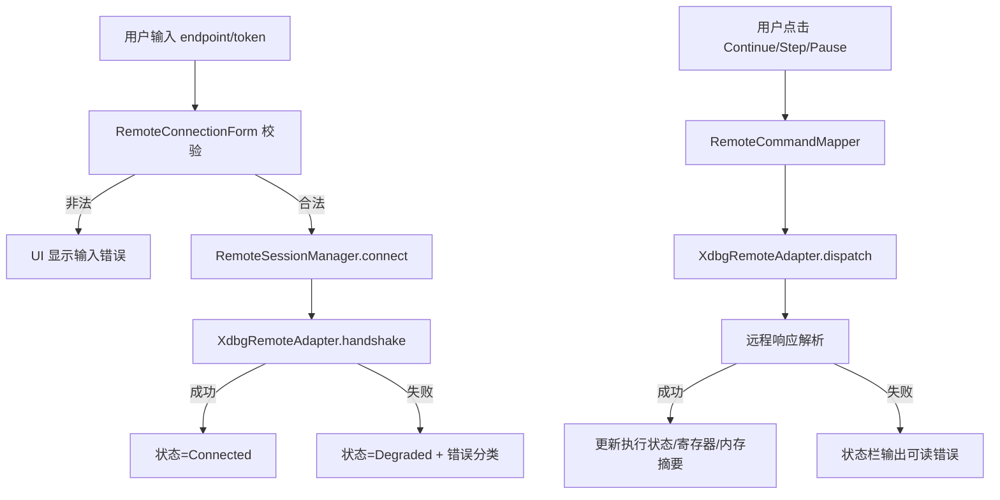
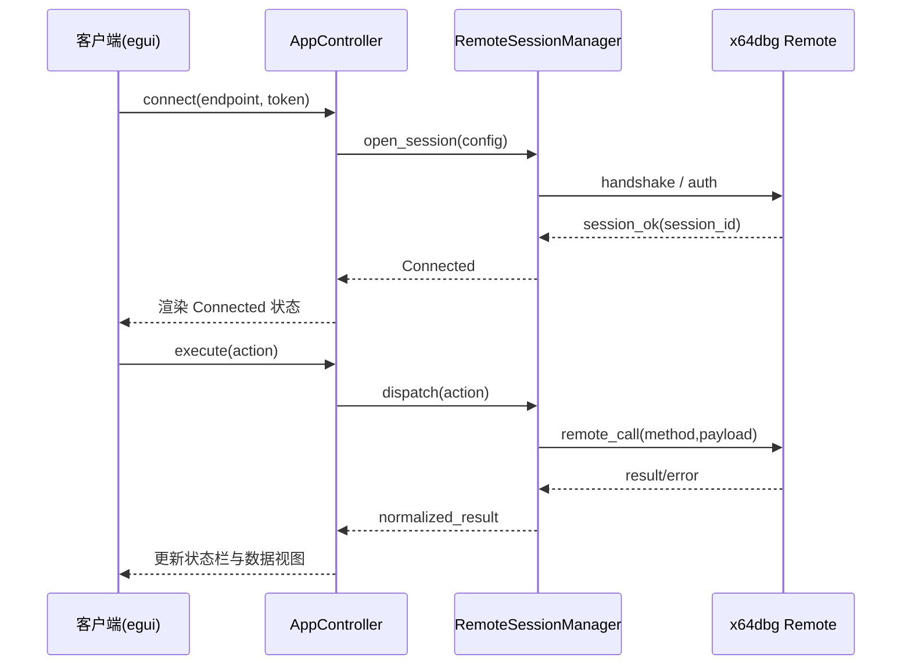

## Context

本变更目标是“接入 x64dbg 远程界面能力”，不是新增一套自研远程调试前端。现有项目已具备调试动作抽象与 UI 控制区，因此采用**适配层 + 会话编排**即可在当前仓库边界内完成落地。

关键约束：
- 仅修改主仓库 `.`；
- 保持最小 UI 改动，避免新建复杂界面模块；
- 重点完成连接、会话状态、核心调试动作映射和可验证链路；
- 兼容现有本地调试路径，远程接入失败时可回退。

## Goals / Non-Goals

**Goals**
- 接入 x64dbg 远程接口并完成连接/断开/重连的生命周期管理。
- 映射核心调试动作（continue、step over、step in、pause、read registers、read memory）。
- 在 UI 中仅增加必要连接控件和状态反馈。
- 输出可执行的接入说明与基础验证结果。

**Non-Goals**
- 不新增自研“完整远程调试 UI 平台”。
- 不在本次变更中引入新的前端框架或页面系统。
- 不扩展为跨工具链统一远程协议层（仅覆盖 x64dbg 远程接口）。

## Proposal Baseline（沿用并细化）

### 高层级 UI 原型（最小化接入）

```text
+----------------------------------------------------------------------------------+
| iosDbg                                                Backend: x64dbg-remote      |
+----------------------------------------------------------------------------------+
| Remote Endpoint: [127.0.0.1:27400                  ] [Connect] [Disconnect]      |
| Session Token : [optional-token                    ]                              |
| Status        : [Disconnected] [Connecting] [Connected] [Degraded]               |
+----------------------------------------------------------------------------------+
| Action Bar: [Continue] [Step Over] [Step In] [Pause] [Read Registers] [Read Mem]|
+----------------------------------------------------------------------------------+
| Result / Log                                                                      |
| - Normal : connected to x64dbg remote session                                     |
| - Error  : command timeout / invalid response / authentication failed             |
| - Note   : UI does not implement a new debugger shell; it forwards actions only   |
+----------------------------------------------------------------------------------+
```

### 用户交互流程（Mermaid）



### 代码变更表（概要）

| 文件路径 | 变更类型 | 变更原因 | 影响范围 |
|---|---|---|---|
| `src/core/engine.rs` | 修改 | 增加 remote backend 调度 | 调试核心 |
| `src/core/session.rs` | 修改 | 增加远程会话状态机 | 会话管理 |
| `src/core/events.rs` | 修改 | 补充远程连接/调用事件 | 事件系统 |
| `src/core/types.rs` | 修改 | 定义远程请求/响应/错误模型 | 类型系统 |
| `src/types/mod.rs` | 修改 | 远程配置项与错误码对外暴露 | 公共接口 |
| `src/ui/control_panel.rs` | 修改 | 连接入口与动作透传 | UI 最小改动 |
| `src/ui/status_bar.rs` | 修改 | 连接状态与错误反馈 | 状态展示 |
| `docs/xdbg-remote-integration.md` | 新增 | 操作与排障说明 | 文档 |

## Decisions

1. 采用 `RemoteAdapter` 抽象隔离 x64dbg 接口细节
- 原因：避免在 UI/engine 中散落协议处理逻辑。
- 取舍：增加一层抽象，但显著降低耦合与测试成本。

2. 远程会话状态机与现有会话并存
- 原因：保障远程失败时本地路径可回退。
- 状态：`Disconnected -> Connecting -> Connected -> Degraded -> Disconnected`。

3. 核心动作采用统一命令映射表
- 原因：便于后续扩展动作，减少分支硬编码。
- 取舍：首版仅覆盖高频动作，复杂命令后续增量支持。

4. UI 仅保留接入控件，不新增自研复杂视图
- 原因：严格匹配“复用远程界面能力”的边界。
- 结果：本次不引入新布局系统，不重构现有面板体系。

## 详细组件架构（ASCII）

```text
系统组件层次
├── UI Layer (egui)
│   ├── ControlPanel
│   │   ├── RemoteConnectionForm
│   │   └── DebugActionForwarder
│   └── StatusBar
│       └── RemoteSessionBadge
├── Application Layer
│   ├── AppController
│   └── DebugEngineFacade
├── Domain Layer
│   ├── RemoteSessionManager
│   ├── RemoteCommandMapper
│   └── RemoteErrorClassifier
└── Infrastructure Layer
    └── XdbgRemoteAdapter
        ├── TransportClient
        ├── HandshakeClient
        └── ResponseDecoder
```

## 数据流图（Mermaid）



## API 调用时序图（Mermaid）



## 详细代码变更清单

| 文件路径 | 变更类型 | 变更说明 | 影响模块 |
|---|---|---|---|
| `src/core/engine.rs` | 修改 | 新增远程引擎分支与动作分发表 `dispatch_remote_action` | Core Engine |
| `src/core/session.rs` | 修改 | 新增 `RemoteSessionState` 与重连判定逻辑 | Session |
| `src/core/events.rs` | 修改 | 新增 `RemoteConnected/RemoteDisconnected/RemoteCommandFailed` 事件 | Event Bus |
| `src/core/types.rs` | 修改 | 定义 `RemoteConfig/RemoteCommand/RemoteResponse` 结构 | Core Types |
| `src/types/mod.rs` | 修改 | 暴露 `RemoteErrorKind`、默认超时与重试配置 | Public Types |
| `src/app.rs` | 修改 | 启动时加载远程配置并注入 adapter | App Bootstrap |
| `src/ui/control_panel.rs` | 修改 | 增加 endpoint 输入、Connect/Disconnect 按钮和动作透传入口 | UI Control |
| `src/ui/status_bar.rs` | 修改 | 增加远程连接徽章与错误摘要文案 | UI Status |
| `src/core/remote/xdbg_adapter.rs` | 新增 | 封装传输层、握手与命令调用（如仓库采用新文件） | Remote Adapter |
| `tests/remote_integration.rs` | 新增 | 覆盖连接成功、超时、鉴权失败、命令映射 | Integration Test |
| `docs/xdbg-remote-integration.md` | 新增 | 连接步骤、动作映射表、故障排查 | Docs |

## Risks / Trade-offs

- 远程接口协议细节可能与预期不一致：通过 adapter 层集中修正。
- 网络不稳定导致命令超时：增加超时与重试上限，避免阻塞 UI。
- 仅做最小 UI 接入可能牺牲部分可视化体验：以“可用优先”为阶段目标。

## Validation Plan

- 单元测试：命令映射、错误分类、状态迁移。
- 集成测试：mock 远程端验证连接/断开/超时/错误恢复。
- 手工验证：真实 endpoint 连接并执行 continue/step/pause/read-register/read-memory 全链路。

**假设（非交互模式）**：
- 当前 schema 仍采用 `spec-driven`，实现前最小必需工件为 proposal/design/tasks。
- x64dbg 远程端提供稳定可调用接口，并能返回可解析结果。
