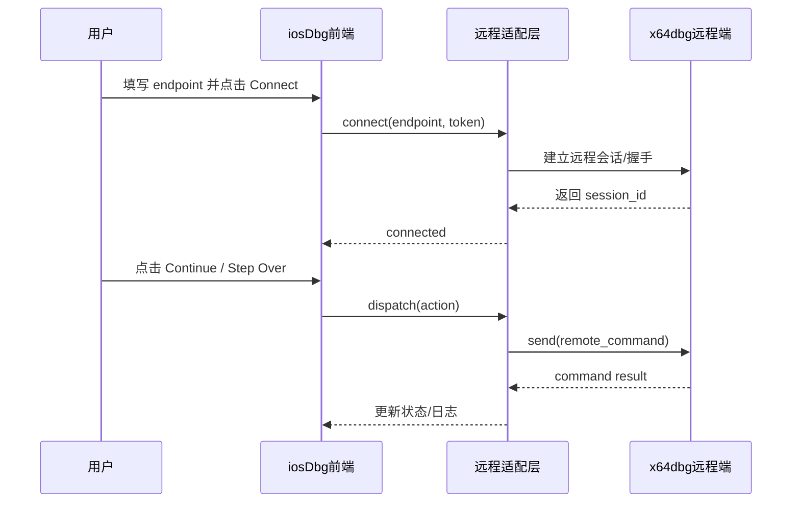

## Why

当前仓库已有本地调试流程，但缺少“直接复用 x64dbg 远程界面能力”的明确接入方案。若继续沿自研 UI/交互路线推进，将偏离本次目标（快速可用接入），并带来不必要的实现成本和维护复杂度。

本变更聚焦：**在主仓库内增加 x64dbg 远程接口适配与会话编排，让现有流程可直接调用 x64dbg 远程能力，不新增自定义前端工程**。

## What Changes

- 新增 x64dbg 远程接口适配层：封装连接、握手、命令发送、响应解析与错误分类。
- 新增远程会话管理：统一连接生命周期（disconnected/connecting/connected/degraded）与重连策略。
- 新增基础调试动作映射：将 continue/step/pause/read-register/read-memory 等动作映射到 x64dbg 远程接口。
- 新增最小化配置项：支持远程地址、超时、重试次数、鉴权令牌（如有）等参数。
- 维持界面最小改动：仅保留“连接状态 + 连接入口 + 核心动作触发”，不新增自研复杂 UI。

### 高层级 UI 原型（最小化接入）

```text
+----------------------------------------------------------------------------------+
| iosDbg                                                Backend: x64dbg-remote      |
+----------------------------------------------------------------------------------+
| Remote Endpoint: [127.0.0.1:27400                  ] [Connect] [Disconnect]      |
| Session Token : [optional-token                    ]                              |
| Status        : [Disconnected] [Connecting] [Connected] [Degraded]               |
+----------------------------------------------------------------------------------+
| Action Bar: [Continue] [Step Over] [Step In] [Pause] [Read Registers] [Read Mem]|
+----------------------------------------------------------------------------------+
| Result / Log                                                                      |
| - Normal : connected to x64dbg remote session                                     |
| - Error  : command timeout / invalid response / authentication failed             |
| - Note   : UI does not implement a new debugger shell; it forwards actions only   |
+----------------------------------------------------------------------------------+
```

### 用户交互流程（Mermaid）



### 代码变更表

| 文件路径 | 变更类型 | 变更原因 | 影响范围 |
|---|---|---|---|
| `src/core/engine.rs` | 修改 | 增加远程后端分发与动作映射入口 | 调试核心 |
| `src/core/session.rs` | 修改 | 增加远程连接生命周期与状态同步 | 会话管理 |
| `src/core/events.rs` | 修改 | 增加远程连接/命令事件类型 | 事件模型 |
| `src/core/types.rs` | 修改 | 增加远程会话与命令响应数据结构 | 核心类型 |
| `src/types/mod.rs` | 修改 | 增加远程配置与错误枚举 | 公共类型 |
| `src/app.rs` | 修改 | 初始化远程配置并接入主流程 | 应用编排 |
| `src/ui/control_panel.rs` | 修改 | 新增 endpoint 输入、连接状态、动作透传按钮 | 现有 UI 最小改动 |
| `src/ui/status_bar.rs` | 修改 | 展示远程连接状态与错误摘要 | 状态反馈 |
| `docs/xdbg-remote-integration.md` | 新增 | 提供连接步骤与核心调试动作说明 | 文档 |

## Capabilities

### New Capabilities

- `xdbg-remote-interface`: 提供 x64dbg 远程接口连接、会话管理与调试动作映射能力。

### Modified Capabilities

- `execution-control`: 将执行控制动作扩展为支持远程后端透传。
- `ui-framework`: 明确 UI 只做最小接入控件，不扩展为自研远程调试界面工程。

## Impact

**受影响代码**：
- 核心调试编排（engine/session/events/types）
- 现有控制面板与状态栏（最小 UI 变更）
- 新增远程接入文档

**不受影响**：
- 现有二进制加载与本地调试主路径（作为回退路径保留）
- 构建与发布流程

**假设（非交互模式）**：
- x64dbg 远程端可通过稳定 endpoint 提供命令调用能力。
- 首阶段以“动作映射可用”优先，不要求本次实现完整远程可视化面板。
