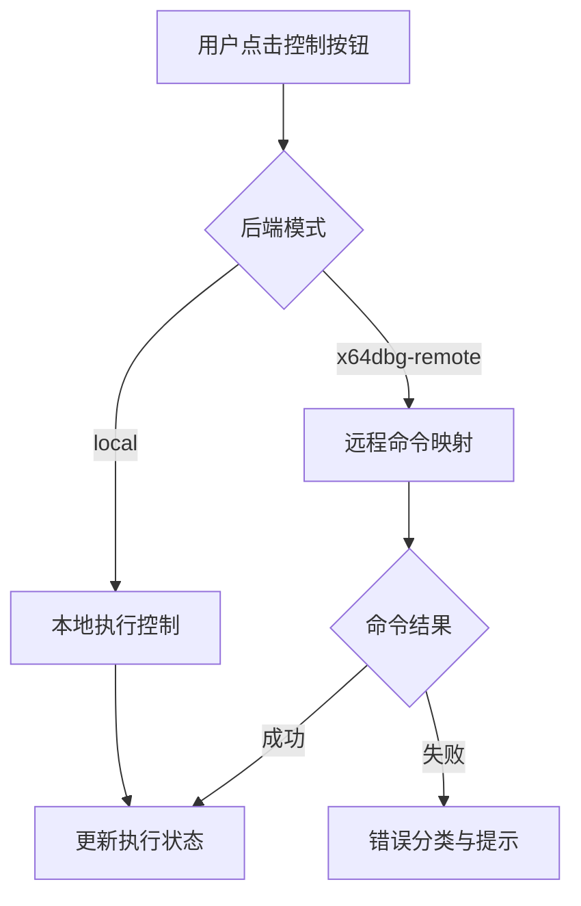

## MODIFIED Requirements

### Requirement: Execute control actions across backend modes
The system SHALL support execution control actions for both local and x64dbg-remote backend modes through a unified action dispatch interface.

#### Scenario: Continue in remote backend mode
- **WHEN** session backend is `x64dbg-remote` and user clicks continue
- **THEN** system dispatches mapped remote command and updates execution state from remote response

#### Scenario: Fallback to local mode when remote unavailable
- **WHEN** remote backend enters degraded/disconnected state and local mode is available
- **THEN** system preserves current UI workflow and blocks only remote-specific actions with clear messaging

### Requirement: Preserve deterministic control feedback
The system SHALL provide deterministic status feedback for step/continue/pause actions regardless of backend type.

#### Scenario: Surface remote action failure
- **WHEN** remote step action fails
- **THEN** system surfaces categorized failure and keeps previous stable execution state

#### Scenario: Surface remote action success
- **WHEN** remote pause action succeeds
- **THEN** system marks execution state as paused and updates timestamped status message

### 能力模型（Mermaid）

### 功能需求表

| 需求 | 类型 | 描述 | 验收场景 |
|---|---|---|---|
| Execute control actions across backend modes | MODIFIED | 统一本地与远程后端的控制动作分发 | Continue in remote backend mode / Fallback to local mode when remote unavailable |
| Preserve deterministic control feedback | MODIFIED | 对动作成功/失败给出稳定状态反馈 | Surface remote action failure / Surface remote action success |
