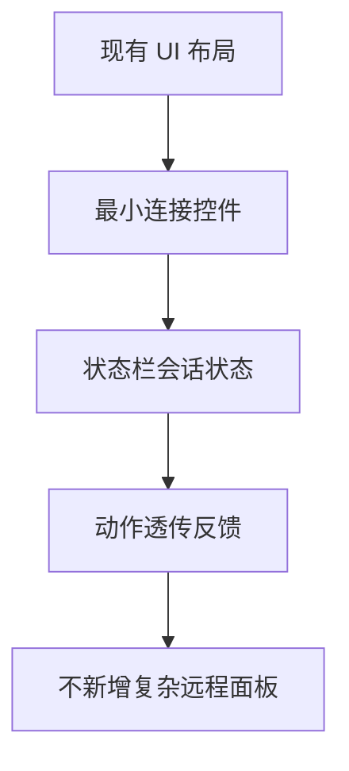

## MODIFIED Requirements

### Requirement: Minimal UI surface for remote integration
The system SHALL expose only the minimal UI controls needed for x64dbg remote integration, including endpoint input, connect/disconnect actions, and session status display.

#### Scenario: Show remote connection controls
- **WHEN** the application starts
- **THEN** the control panel shows endpoint/token fields and connect/disconnect buttons

#### Scenario: Show remote session badge
- **WHEN** remote state changes
- **THEN** the status bar reflects `disconnected/connecting/connected/degraded` without requiring additional custom panels

### Requirement: Avoid custom remote debugger shell
The system SHALL NOT introduce a new custom remote debugger shell UI in this change.

#### Scenario: Keep existing layout unchanged
- **WHEN** remote integration is enabled
- **THEN** existing layout regions remain unchanged and only minimal controls are added

#### Scenario: Block out-of-scope UI expansion
- **WHEN** implementation planning includes new remote-specific complex panes
- **THEN** those panes are deferred and excluded from this change scope

### 能力模型（Mermaid）

### 功能需求表

| 需求 | 类型 | 描述 | 验收场景 |
|---|---|---|---|
| Minimal UI surface for remote integration | MODIFIED | 提供最小必要远程接入控件与状态显示 | Show remote connection controls / Show remote session badge |
| Avoid custom remote debugger shell | MODIFIED | 限制范围，不新增复杂远程界面工程 | Keep existing layout unchanged / Block out-of-scope UI expansion |
