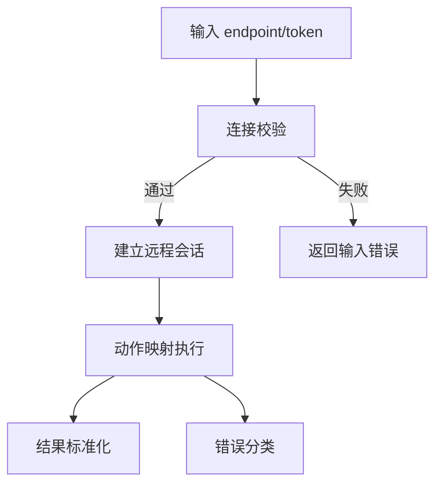

## ADDED Requirements

### Requirement: Connect to x64dbg remote endpoint
The system SHALL provide a configurable connection flow to an x64dbg remote endpoint, including endpoint validation, optional token usage, and deterministic connection state updates.

#### Scenario: Establish remote session successfully
- **WHEN** the user submits a valid endpoint and the remote service is reachable
- **THEN** the system enters `connected` state and records a usable session identifier

#### Scenario: Reject invalid endpoint format
- **WHEN** the user submits an invalid endpoint string
- **THEN** the system blocks connection attempt and shows a validation error

### Requirement: Map core debug actions to remote commands
The system SHALL map core debug actions to x64dbg remote methods with normalized result payloads.

#### Scenario: Forward continue action
- **WHEN** user triggers continue in the control panel
- **THEN** system sends mapped remote continue command and updates runtime state from response

#### Scenario: Forward register read action
- **WHEN** user requests register snapshot
- **THEN** system fetches register data via remote API and converts response into internal register model

### Requirement: Classify remote errors for stable handling
The system SHALL classify remote failures into stable categories for UI messaging and retry policy.

#### Scenario: Classify timeout failure
- **WHEN** remote command exceeds timeout threshold
- **THEN** system marks error as `timeout` and surfaces retry guidance

#### Scenario: Classify authentication failure
- **WHEN** remote endpoint rejects token or authorization context
- **THEN** system marks error as `auth_failed` and requests credential correction

### 能力模型（Mermaid）

### 功能需求表

| 需求 | 类型 | 描述 | 验收场景 |
|---|---|---|---|
| Connect to x64dbg remote endpoint | ADDED | 连接 x64dbg 远程端并管理连接状态 | Establish remote session successfully / Reject invalid endpoint format |
| Map core debug actions to remote commands | ADDED | 将核心调试动作映射为远程命令 | Forward continue action / Forward register read action |
| Classify remote errors for stable handling | ADDED | 对远程错误进行稳定分类与提示 | Classify timeout failure / Classify authentication failure |
